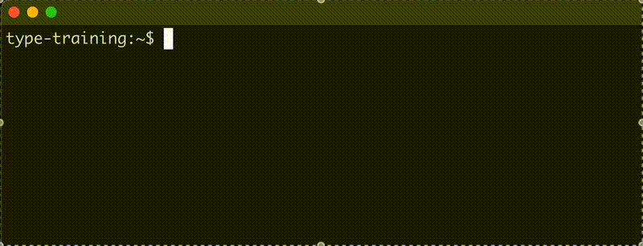

# Type Training

This is a command-line program written in GO to practice typing on the keyboard.

## Usage

Install the binary or build program from source.

Launch the binary inside a console window via `./<binary-name>` command

Start typing the words you see on the screen. Correct letters light up as green, typing in a wrong letter makes it red. Use `backspace` to delete incorrect letters.

When the whole sentence is green, use `Enter` to get a new sentence.



## Installation

### Download binary

Download a [binary for your platform](https://github.com/Serious-Fin/type-training/releases/tag/v1.0.0) from release page.

On linux/mac you might need to add execution permission to file:

```zsh
chmod +x <binary name>
```

### Build from source

Open a console window and clone repository locally:

```zsh
git clone https://github.com/Serious-Fin/type-training.git
```

Move into the cloned repository

```zsh
cd type-training
```

Install all go dependencies (you might need to [install go if you haven't already](https://go.dev/doc/install) before this step)

```zsh
go install
```

Build the project

```zsh
go build
```

Now you should have an executable `type-training`. Run it with:

```zsh
./type-training
```
